# Launch Stack

## (Optional 1) Launch Stack for Global Regions

### Launch Main Stack
1. Sign in to the AWS Management Console and use the button below to launch the `log-hub` AWS CloudFormation template.
    
    {target=_blank}

3. The template launches in the US East (N. Virginia) Region by default. To launch the solution in a different AWS Region, use the Region selector in the console navigation bar.

4. On the **Create stack** page, verify that the correct template URL shows in the **Amazon S3 URL** text box and choose **Next**.

5. On the **Specify stack details** page, assign a name to your solution stack. For information about naming character limitations, refer to [IAM and STS Limits](https://docs.aws.amazon.com/IAM/latest/UserGuide/reference_iam-limits.html) in the *AWS Identity and Access Management User Guide*.

6. Under **Parameters**, review the parameters for the template and modify them as necessary. This solution uses the following default values.

    | Parameter  | Default          | Description                                                  |
    | ---------- | ---------------- | ------------------------------------------------------------ |
    | Admin User Email | `<Requires input>` | Specify the email of the Administrator to receive an auto-generated password. You need to use the email and password to log in to the Log Hub console. You can create more users directly in the provisioned Cognito User Pool after launching the solution. |

7. Choose **Next**.

8. On the **Configure stack options** page, choose **Next**.

9. On the **Review** page, review and confirm the settings. Check the box acknowledging that the template creates AWS Identity and Access Management (IAM) resources.

10. Choose **Create** stack to deploy the stack.

You can view the status of the stack in the AWS CloudFormation console in the **Status** column. You should receive
a **CREATE_COMPLETE** status in approximately 15 minutes.

This solution generates a CloudFront domain name that gives you access to the Log Hub console. The domain name can be found
in the **Outputs** tab of the CloudFormation template as an **WebConsoleUrl**. 

After successful deployment, an email containing the temporary login password is sent to the provided email address. 

Use the following procedure to log in to the web console.

1. Open the **WebConsoleUrl** using a web browser, then navigate to a sign-in page.
2. Sign in with the **AdminEmail** and the temporary password.

    a. Set a new account password.

    b. (Optional) Verify your email address for account recovery.

3. After the verification is complete, the system opens the web console.

Once you have logged into the Log Hub console, you can [import an AOS domain](./domains/import.md#import-opensearch-domain) and [create log analytics pipelines](pipelines/index.md).

## (Optional 2) Launch Stack for China Regions with Authing

### Create Authing Application

!!! info "Info"
    
    We use Authing as one of the OIDC as an example in this guide.

1. Go to [Authing portal](https://console.authing.cn/console){target=_blank}

2. Create an Self-built App in the following location:

    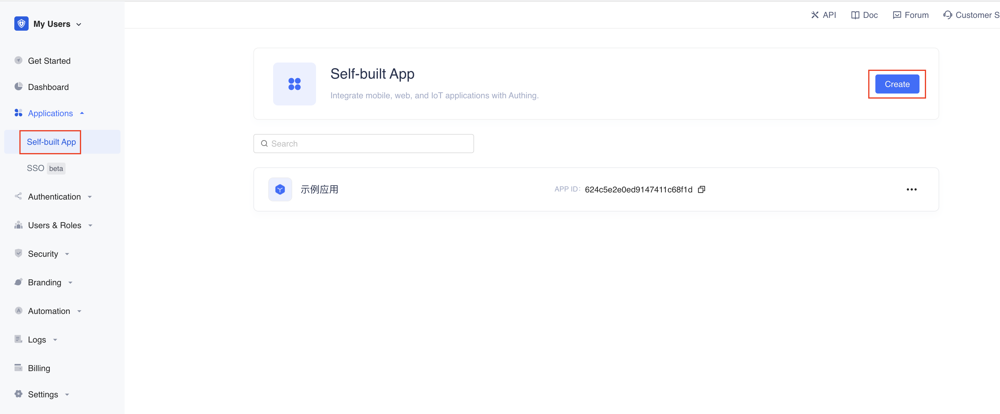

3. Enter Application name and Subdomain:

    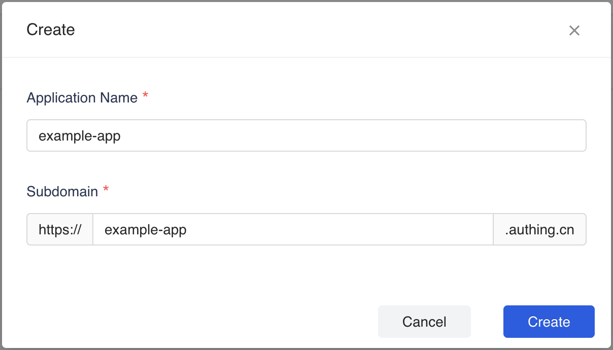

4. Please save `App ID` and `Issuer` from Endpoint Information:

    

5. Set the Authentication Configuration as follows, change the `login callback URL` and `logout callback URL` as your domiain name:

    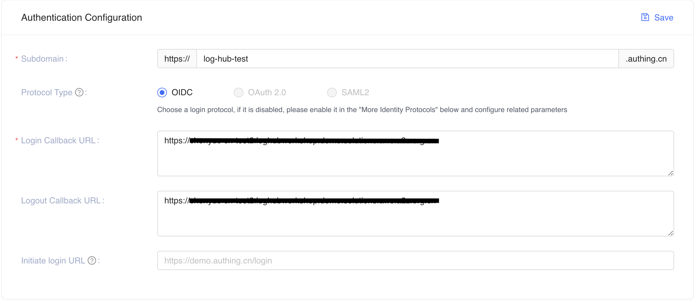

6. Set the Authorization Configuration as follows:

    

You have successfully created an authing Self-built application, please save `App ID` and `Issuer` from Endpoint Information. They will be used in the next section.

### Launch Main Stack
1. Sign in to the AWS Management Console and use the button below to launch the `log-hub` AWS CloudFormation template.
    
    {target=_blank}

2. On the **Create stack** page, verify that the correct template URL shows in the **Amazon S3 URL** text box and choose **Next**.

3. On the **Specify stack details** page, assign a name to your solution stack. For information about naming character limitations, refer to [IAM and STS Limits](https://docs.aws.amazon.com/IAM/latest/UserGuide/reference_iam-limits.html) in the *AWS Identity and Access Management User Guide*.

4. Under **Parameters**, review the parameters for the template and modify them as necessary. This solution uses the following default values.

    | Parameter  | Default          | Description                                                  |
    | ---------- | ---------------- | ------------------------------------------------------------ |
    | Oidc Client Id | `<Requires input>` | OpenId Connector Client Id |
    | Oidc Provider  | `<Requires input>` | OpenId Connector Provider Issuer (please add `https://` at beginning) |
    | Oidc Customer Domain | `<Requires input>` | Customer Domain for Log Hub (please add `https://` at beginning), this will be used to access LogHub web console |

5. Choose **Next**.

6. On the **Configure stack options** page, choose **Next**.

7. On the **Review** page, review and confirm the settings. Check the box acknowledging that the template creates AWS Identity and Access Management (IAM) resources.

8. Choose **Create** stack to deploy the stack.

    You can view the status of the stack in the AWS CloudFormation console in the **Status** column. You should receive a **CREATE_COMPLETE** status in approximately 15 minutes.

9. This solution generates a CloudFront address that gives you access to the Log Hub console. The address can be found in the **Outputs** tab of the CloudFormation template as an **WebConsoleUrl**. 

    For China region, we need to add the Cloudfront address as a **CNAME record** under your Oidc Customer Domain, to enable public access. 

    

    You also need to add an alternative domain names to your newly created Cloudfront

    

Use the following procedure to log in to the web console.

1. Open the **Oidc Customer Domain URL** using a web browser.
    The browser may warn you that the link you are going to is not secure. 
    Please just ignore the warning and choose the **Advanced** button.

    **The following graph is an example of Chrome**:
    
    Click the revealed URL. 

    **The following graph is an example of FireFox**:
    
    Click **Accept the Risk and Continue**.

    !!! Note "Note"
        If you still can not access, please double check if you have disabled **Enhanced Protection** function in your browser.

        
2. Click **Sign in to Log Hub**, then you will be navigated to Authing
    
3. Type in your Authing username and password.

Then you can successfully access the LogHub Web Console.

Once you have logged into the Log Hub console, you can [import an AOS domain](./domains/import.md#import-opensearch-domain) and [create log analytics pipelines](pipelines/index.md).

## (Optional 3) Launch Stack for China Regions with Keycloak

### Deploy Keycloak cloudformation
1. Sign in to the AWS Management Console and use the button below to launch the [**Keycloak on AWS**](https://github.com/aws-samples/keycloak-on-aws){target=_blank} CloudFormation template. 
It's a solution developed and maintained by aws solutions team.
    
    {target=_blank}

    !!! Note "Note"
        As a default, the Launch button will create a new VPC and deploy Keycloak within it. If you want to play with the keycloak-on-aws solution and try deploy it inside your existing VPC, please **do not** deploy it in your default VPC!!!

2. Please type in the folllowing paramaters accordingly:

    | Parameter  | Default          | Description                                                  |
    | ---------- | ---------------- | ------------------------------------------------------------ |
    | CertificateArn | `<Requires input>` | The certificate used by ALB for accessing Keycloak  |
    | DatabaseInstanceType  | `<Requires input>` | RDS instance type, which is used to store Keycloak's configuration and user information |
    | MinContainers | `<Requires input>` | Minimum number of containers that RDS can have |
    | MaxContainers | `<Requires input>` | Maximum number of containers that RDS can have |
    | AutoScalingTargetCpuUtilization | `<Requires input>` | The threshold CPU percentage to trigger autoscaling |
    | JavaOpts | `<Optional>` | JAVA opts environment variable |

    !!! Note "Note"
        For **DatabaseInstanceType**, we recommand you choose "r5" series. please do not choose "r6" for they are not supported in China resions.

    

3. Choose **Next**.

4. On the **Configure stack options** page, choose **Next**.

5. On the **Review** page, review and confirm the settings. Check the box acknowledging that the template creates AWS Identity and Access Management (IAM) resources.

6. Choose **Create** stack to deploy the stack.

    You can view the status of the stack in the AWS CloudFormation console in the **Status** column. You should receive a **CREATE_COMPLETE** status in approximately 5 minutes.

7. Once the stack has finished deployment, you can find the ELB address for your Keycloak through **Outputs** of your cloudformation, you need to add a record in your hosted domain and assign a domain name for it.

    Then you can access the Keycloak frontend through your assigned domain name:

    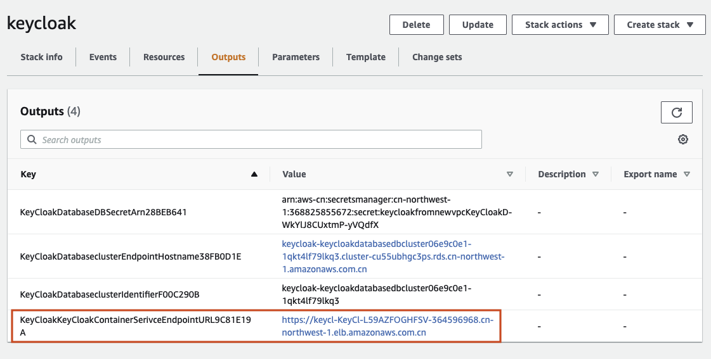

    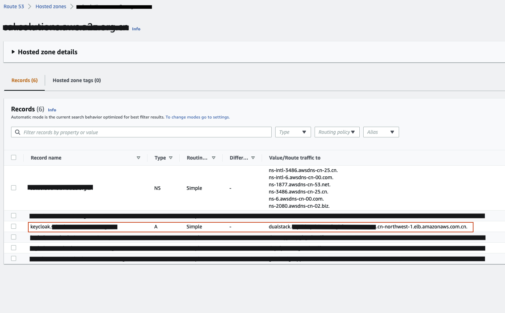

8. Before login, we need to fetch the keycloak username and password, which has been generated for you by the cloudformation template. Go to <a href="https://console.amazonaws.cn/secretsmanager/home" target="_blank">AWS Console > Secrets Manager</a>

    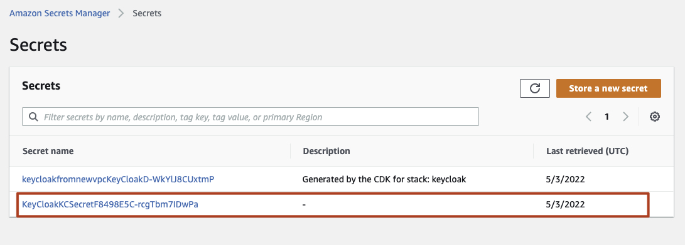

    We can find that there is a secret which name starts with **KeyCloakKCSecret** is already there. 

9. Click the secret name. Then click **Retrieve secret value**: 

    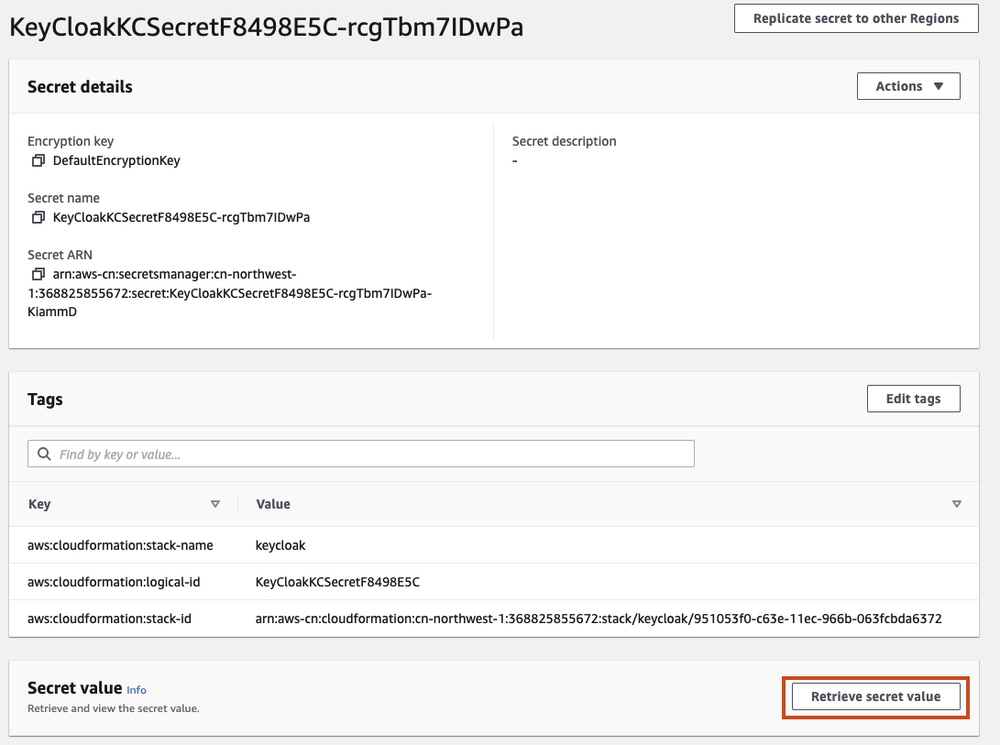

    We can find username and password there:

    

10. By accessing the assigned domain name, you will be able to access the keycloak portal, click **Administration Console** here to login by username and password.

    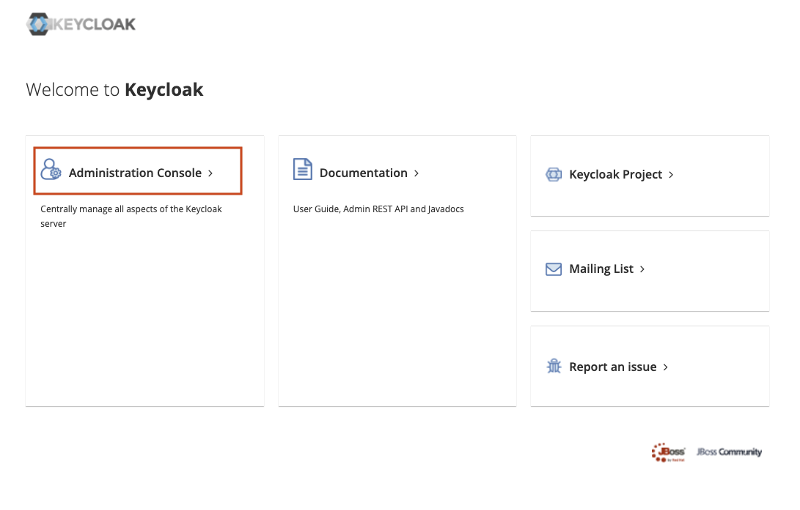

11. Type in **username** and **password**:

    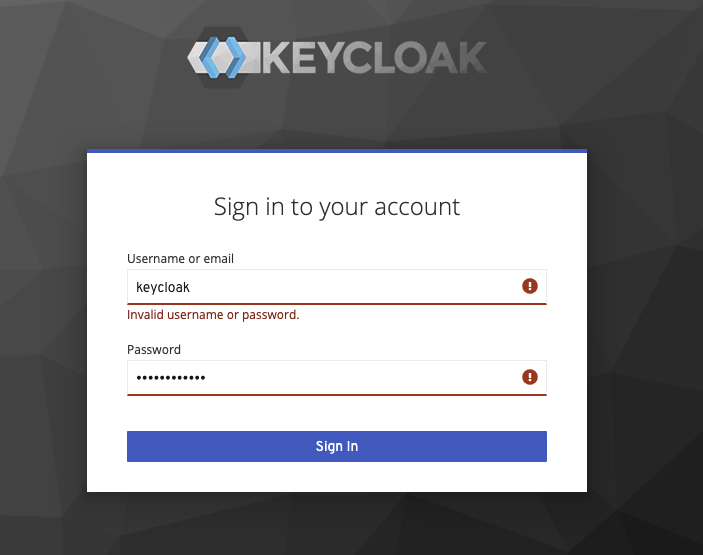

12. Then you will be able to access the Keycloak portal. We need to add a realm in Keycloak, click **Add realm** on the left-upper page:

    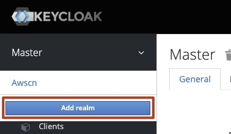

    Type in the realm name you want, then click create:

    

    After creation, we can see realm setting page here, click **Endpoints > OpenID Endpoint Configuration** here:

    

    A json file will open up in your browser, please save the **issuer** value here, it will be used as an input later in LogHub:

    

    Then we can go back to Keyclaok portal and select **Clients** on the left side column, click **Create**:

    

    Please type in a Client ID, which must contain 24 letters or numbers (case-insensitive):

    

    After creation of Client, we need to change the Client settings, please change the following fields accordingly:

    

    Click Save, and we are done with all the Keycloak settings!

    Please also save the **Client ID**, this value will be used in the next section as an input.

13. Next, we need to create keycloak users. Please go to **Users** Tab on the left column:

    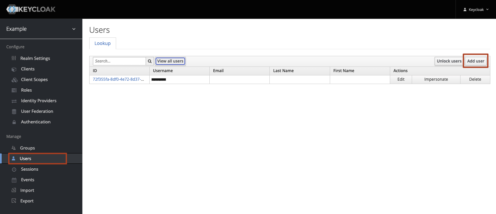

    Click **Add user** and type in the **Username** you want:

    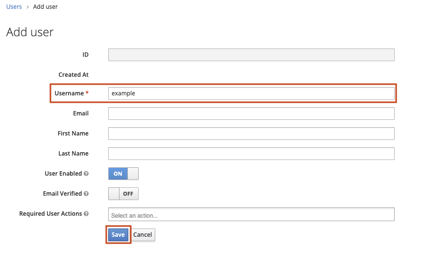

    After creation, we can create password for this user, select **Credentials** here:

    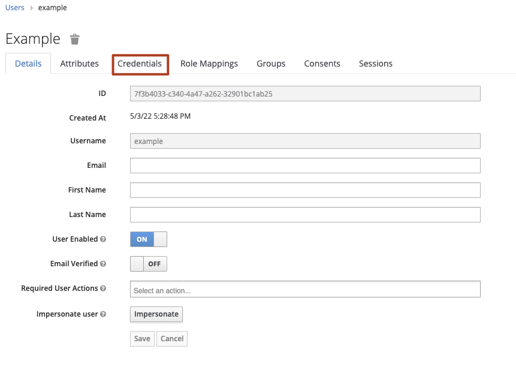

    And fill in the password:

    

14. Previously we have got a issuer value from realm configuration, which should be: `https://<ALB_ADDRESS>/auth/realms/<REALM_NAME>`, please substitute the <ALB_ADDRESS> with the domain name. 

    (Issuer then becomes: `https://<KEYCLOAK_DOMAIN_NAME>/auth/realms/<REALM_NAME>`)

    Save this issuer value for later usage.

### Launch Main Stack
1. Sign in to the AWS Management Console and use the button below to launch the `log-hub` AWS CloudFormation template.
    
    {target=_blank}

2. On the **Create stack** page, verify that the correct template URL shows in the **Amazon S3 URL** text box and choose **Next**.

3. On the **Specify stack details** page, assign a name to your solution stack. For information about naming character limitations, refer to [IAM and STS Limits](https://docs.aws.amazon.com/IAM/latest/UserGuide/reference_iam-limits.html) in the *AWS Identity and Access Management User Guide*.

4. Under **Parameters**, please paste the **issuer** value into Oidc Provider, as well as the **Client ID** into Oidc Client Id. This solution uses the following default values. Also type in the domain you have, which has got ICP license. 

    | Parameter  | Default          | Description                                                  |
    | ---------- | ---------------- | ------------------------------------------------------------ |
    | Oidc Client Id | `<Requires input>` | OpenId Connector Client Id |
    | Oidc Provider  | `<Requires input>` | OpenId Connector Provider Issuer (please add `https://` at beginning) |
    | Oidc Customer Domain | `<Requires input>` | Customer Domain for Log Hub (please add `https://` at beginning), this will be used to access LogHub web console |

5. Choose **Next**.

6. On the **Configure stack options** page, choose **Next**.

7. On the **Review** page, review and confirm the settings. Check the box acknowledging that the template creates AWS Identity and Access Management (IAM) resources.

8. Choose **Create** stack to deploy the stack.

    You can view the status of the stack in the AWS CloudFormation console in the **Status** column. You should receive a **CREATE_COMPLETE** status in approximately 15 minutes.

9. This solution generates a CloudFront address that gives you access to the Log Hub console. The address can be found in the **Outputs** tab of the CloudFormation template as an **WebConsoleUrl**. 

    For China region, we need to add the Cloudfront address as a **CNAME record** under your domain name, to enable public access. 

    

    You also need to add an alternative domain names to your newly created Cloudfront

    

10. Then you are able to access the LogHub frontend console through the alternative domain.

11. Select **Sign in** and type in the username you created in the previous section, as well as the password. And the LogHub Console should look like this:

    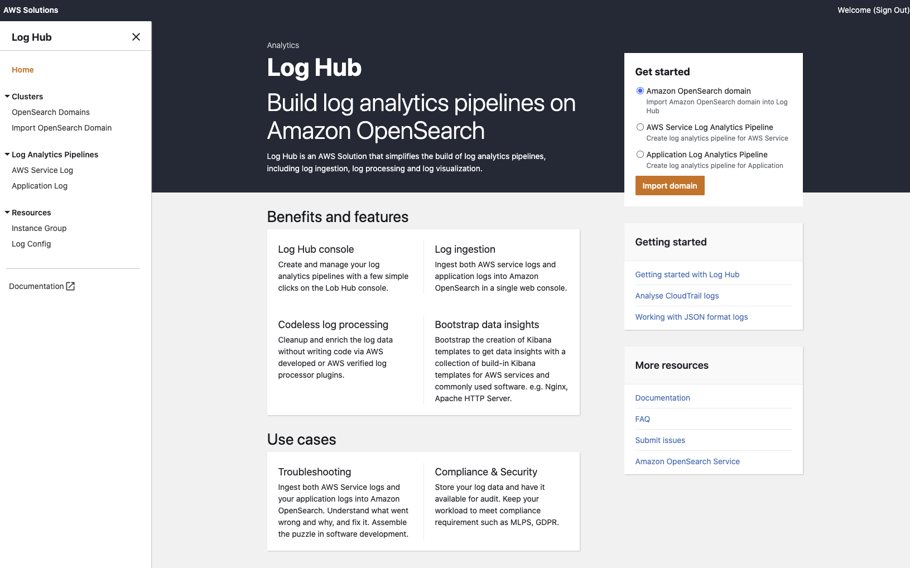